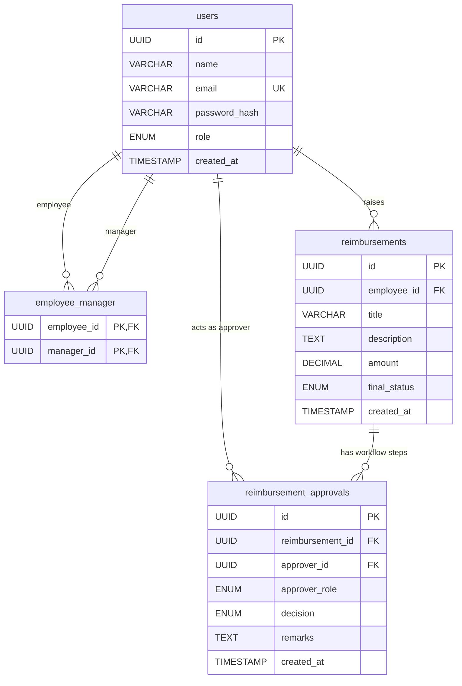

# Database Schema

The Reimbursements Management System uses PostgreSQL as its database. Below is the detailed schema for all tables, columns, constraints, and relationships.

---

## 1. `users` Table

Stores all user accounts (Employees, Managers, APE, and CFO).

| Column Name | Data Type | Constraints | Description |
| :--- | :--- | :--- | :--- |
| `id` | `UUID` | **PRIMARY KEY**, Default: `UUIDV4` | Unique identifier for the user. |
| `name` | `VARCHAR(100)` | `NOT NULL` | Full name of the user. |
| `email` | `VARCHAR(255)` | `NOT NULL`, **UNIQUE** | User's email address (must be `@org.com`). |
| `password_hash` | `VARCHAR(255)` | `NOT NULL` | bcrypt-hashed password (cost factor 12). |
| `role` | `ENUM` | `NOT NULL`, Default: `'EMP'` | Allowed values: `'EMP'`, `'RM'`, `'APE'`, `'CFO'`. |
| `created_at` | `TIMESTAMP` | `NOT NULL`, Default: `NOW()` | Timestamp when the user was registered. |

**Indexes:**
- `users_email_unique` ON `email` (UNIQUE)
- `users_role_idx` ON `role`

---

## 2. `employee_manager` Table

A many-to-many join table to manage reporting structures (which employees report to which managers).

| Column Name | Data Type | Constraints | Description |
| :--- | :--- | :--- | :--- |
| `employee_id` | `UUID` | `NOT NULL`, **FOREIGN KEY** (`users.id`) `ON DELETE CASCADE` | The employee. |
| `manager_id` | `UUID` | `NOT NULL`, **FOREIGN KEY** (`users.id`) `ON DELETE CASCADE` | The reporting manager (RM). |

**Constraints:**
- **Primary Key:** Composite key on `(employee_id, manager_id)` ensuring an employee is not assigned to the same manager multiple times.

**Indexes:**
- `employee_manager_manager_id_idx` ON `manager_id`

---

## 3. `reimbursements` Table

Stores the core reimbursement requests raised by employees.

| Column Name | Data Type | Constraints | Description |
| :--- | :--- | :--- | :--- |
| `id` | `UUID` | **PRIMARY KEY**, Default: `UUIDV4` | Unique identifier. |
| `employee_id` | `UUID` | `NOT NULL`, **FOREIGN KEY** (`users.id`) `ON DELETE CASCADE` | The employee who requested the reimbursement. |
| `title` | `VARCHAR(200)` | `NOT NULL` | Title/Summary of the request. |
| `description` | `TEXT` | `NULL` | Detailed description. |
| `amount` | `DECIMAL(12, 2)` | `NOT NULL` | Monetary amount with high precision. |
| `final_status`| `ENUM` | `NOT NULL`, Default: `'PENDING'` | Allowed values: `'PENDING'`, `'APPROVED'`, `'REJECTED'`. |
| `created_at` | `TIMESTAMP` | `NOT NULL`, Default: `NOW()` | Timestamp when requested. |

**Indexes:**
- `reimbursements_employee_id_idx` ON `employee_id`
- `reimbursements_final_status_idx` ON `final_status`

---

## 4. `reimbursement_approvals` Table

Acts as an audit trail for the approval workflow. It records every decision made by an RM or APE on a reimbursement.

| Column Name | Data Type | Constraints | Description |
| :--- | :--- | :--- | :--- |
| `id` | `UUID` | **PRIMARY KEY**, Default: `UUIDV4` | Unique identifier. |
| `reimbursement_id`| `UUID` | `NOT NULL`, **FOREIGN KEY** (`reimbursements.id`) `ON DELETE CASCADE` | The reimbursement being acted upon. |
| `approver_id` | `UUID` | `NOT NULL`, **FOREIGN KEY** (`users.id`) `ON DELETE CASCADE` | The user (RM or APE) who made the decision. |
| `approver_role` | `ENUM` | `NOT NULL` | Role of the approver at the time (`'RM'`, `'APE'`, `'CFO'`). |
| `decision` | `ENUM` | `NOT NULL` | Allowed values: `'APPROVED'`, `'REJECTED'`. |
| `remarks` | `TEXT` | `NULL` | Optional comments from the approver. |
| `created_at` | `TIMESTAMP` | `NOT NULL`, Default: `NOW()` | Timestamp of the decision. |

**Indexes:**
- `approvals_reimbursement_id_idx` ON `reimbursement_id`
- `approvals_approver_role_idx` ON `approver_role`

---

## Entity Relationship Diagram (ERD)

